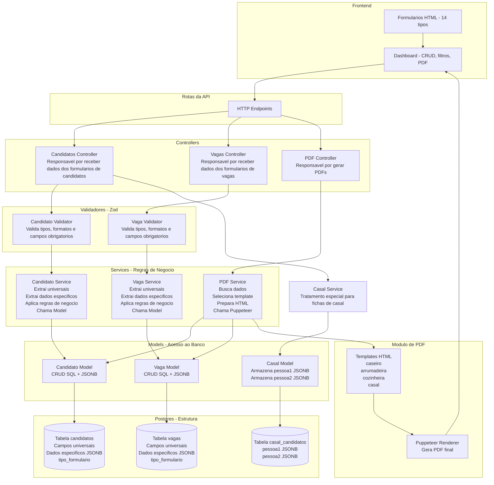

```mermaid
flowchart TD

%% ============================
%% FRONTEND LAYER
%% ============================

subgraph FRONTEND [Frontend]
A1[Formularios HTML - 14 tipos] 
A2[Dashboard - CRUD, filtros, PDF]
A1 --> A2
end

%% FRONTEND calls ROUTES
A2 --> B[Routes]

%% ============================
%% ROUTES
%% ============================
subgraph ROUTES [Rotas da API]
B[HTTP Endpoints]
end

%% ROUTES go to CONTROLLERS
B --> C1
B --> C2
B --> C3

%% ============================
%% CONTROLLERS
%% ============================

subgraph CONTROLLERS [Controllers]
C1[Candidatos Controller\nResponsavel por receber dados dos formularios de candidatos]
C2[Vagas Controller\nResponsavel por receber dados dos formularios de vagas]
C3[PDF Controller\nResponsavel por gerar PDFs]
end

%% CONTROLLERS → VALIDATORS
C1 --> V1
C2 --> V2

%% ============================
%% VALIDATORS
%% ============================

subgraph VALIDATORS [Validadores - Zod]
V1[Candidato Validator\nValida tipos, formatos e campos obrigatorios]
V2[Vaga Validator\nValida tipos, formatos e campos obrigatorios]
end

%% VALIDATORS → SERVICES
V1 --> S1
V2 --> S2

%% PDF CONTROLLER → PDF SERVICE
C3 --> S3

%% ============================
%% SERVICES
%% ============================

subgraph SERVICES [Services - Regras de Negocio]
S1[Candidato Service\nExtrai universais\nExtrai dados especificos\nAplica regras de negocio\nChama Model]
S2[Vaga Service\nExtrai universais\nExtrai dados especificos\nAplica regras de negocio\nChama Model]
S3[PDF Service\nBusca dados\nSeleciona template\nPrepara HTML\nChama Puppeteer]
end

%% SERVICES → MODELS
S1 --> M1
S2 --> M2
S3 --> M1
S3 --> M2

%% ============================
%% MODELS
%% ============================

subgraph MODELS [Models - Acesso ao Banco]
M1[Candidato Model\nCRUD SQL + JSONB]
M2[Vaga Model\nCRUD SQL + JSONB]
M3[Casal Model\nArmazena pessoa1 JSONB\nArmazena pessoa2 JSONB]
end

%% EXTRA: Candidato controller → casal service
C1 --> SC[Casal Service\nTratamento especial para fichas de casal]
SC --> M3

%% MODELS → DB
M1 --> DB1
M2 --> DB2
M3 --> DB3

%% ============================
%% DATABASE
%% ============================

subgraph DATABASE [Postgres - Estrutura]
DB1[(Tabela candidatos\nCampos universais\nDados especificos JSONB\ntipo_formulario)]
DB2[(Tabela vagas\nCampos universais\nDados especificos JSONB\ntipo_formulario)]
DB3[(Tabela casal_candidatos\npessoa1 JSONB\npessoa2 JSONB)]
end

%% ============================
%% PDF MODULE
%% ============================

S3 --> T1
T1 --> T2
T2 --> A2

subgraph PDF [Modulo de PDF]
T1[Templates HTML\ncaseiro\narrumadeira\ncozinheira\ncasal]
T2[Puppeteer Renderer\nGera PDF final]
end
```
